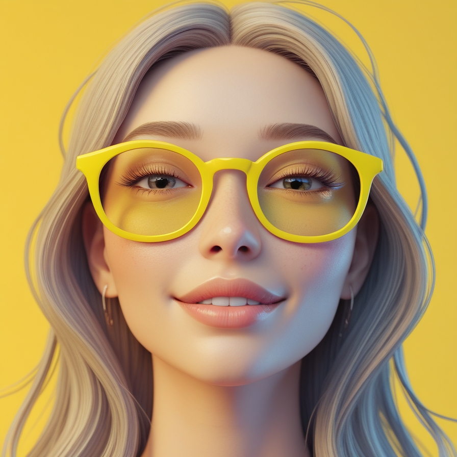

# 🕶️ Oculos Store

Bem-vindo ao projeto **Oculos Store**! Este é um e-commerce fictício de óculos, desenvolvido com Next.js, React e Tailwind CSS, focado em responsividade, performance e design moderno.

## 🚀 Tecnologias Utilizadas

- [Next.js](https://nextjs.org/)
- [React](https://react.dev/)
- [Tailwind CSS](https://tailwindcss.com/)

## 📁 Estrutura do Projeto

```
├── public/
│   ├── logo.png
│   ├── menu.svg
│   ├── x.svg
│   └── ...
├── src/
│   ├── app/
│   │   ├── layout.js
│   │   └── page.js
│   └── components/
│       ├── Header/
│       ├── Footer/
│       ├── Card/
│       ├── Button/
│       └── ...
├── package.json
└── README.md
```

## ✨ Funcionalidades

- Menu responsivo com toggle para mobile
- Componentes reutilizáveis (Header, Footer, Card, Button)
- Navegação otimizada com Next.js
- Estilização moderna com Tailwind CSS
- Imagens otimizadas com o componente `Image` do Next.js

## 🖥️ Como rodar o projeto

1. Clone o repositório:
   ```bash
   git clone https://github.com/seu-usuario/oculos-store.git
   ```
2. Instale as dependências:
   ```bash
   npm install
   ```
3. Rode o projeto:
   ```bash
   npm run dev
   ```
4. Acesse em [http://localhost:3000](http://localhost:3000)

## 📸 Preview



## 👨‍💻 Autor

Desenvolvido por Lucas Santos (https://github.com/LucasSantos96) com 💜

---

Sinta-se à vontade para contribuir, sugerir melhorias ou reportar issues!
